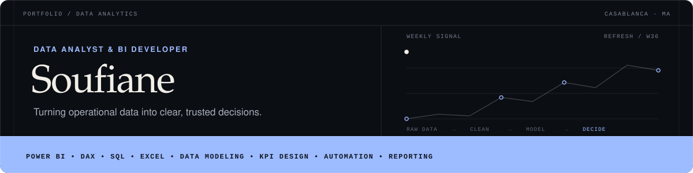
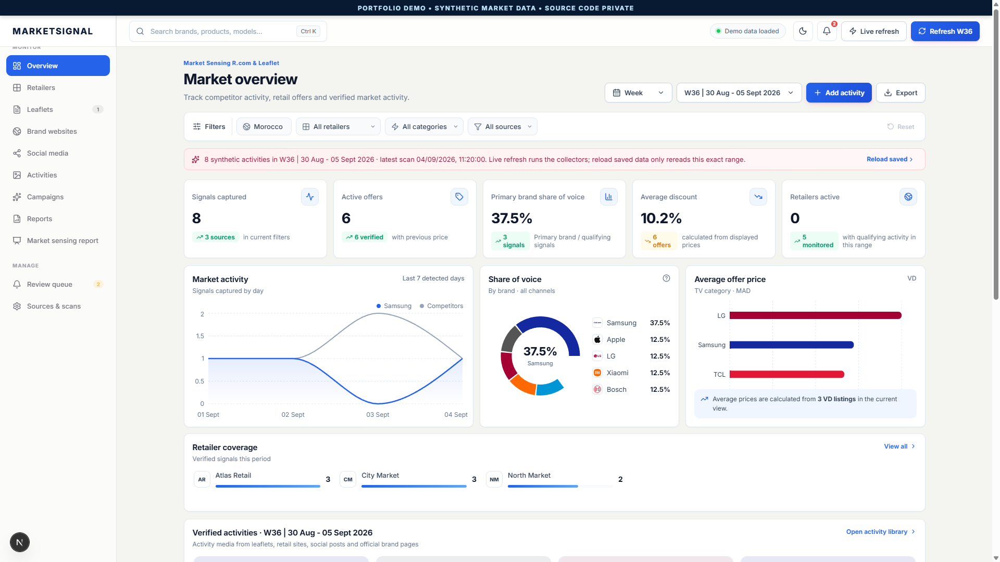
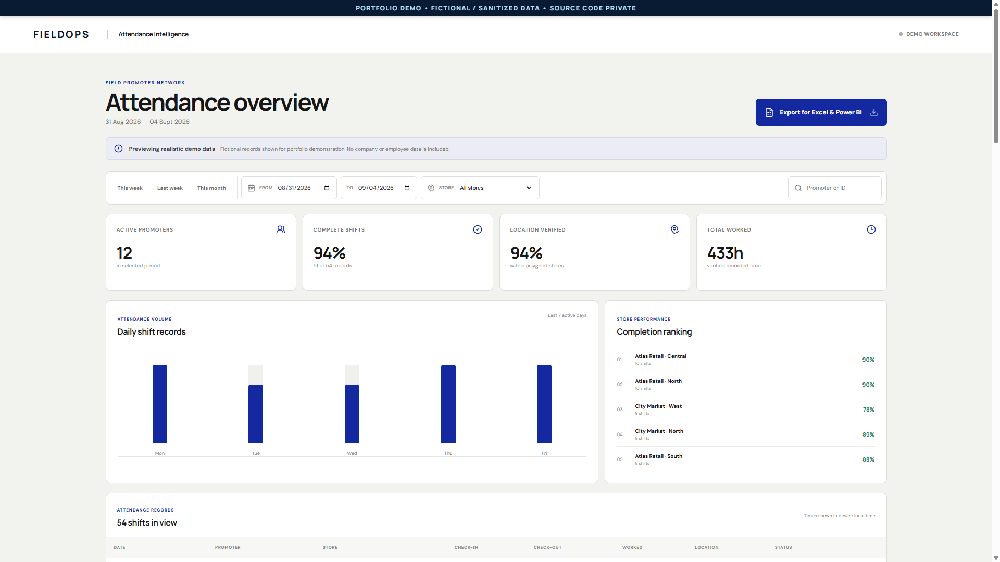

## About me

I'm a **Data Analyst and BI Developer** who turns recurring operational data into decision-ready systems. My work combines Excel cleaning, Power BI, DAX, dimensional modeling, KPI design, SQL, automation, and practical analytics product development.

I focus on the full path from raw weekly files to trusted reporting: **collect → clean → validate → model → analyze → visualize → refresh**.

## Core toolkit

## Featured case studies

### [MarketSignal — Retail Intelligence Platform](https://github.com/itsMacht/marketsignal-portfolio-showcase)

A B2B retail-intelligence SaaS prototype for tracking public prices, promotions, campaigns, launches, share of voice, retailer coverage, and reporting workflows.

`Retail analytics` · `Data quality` · `Automated collection` · `PostgreSQL` · `Dashboards` · `Reporting`

### [Field Workforce Intelligence Platform](https://github.com/itsMacht/field-workforce-platform-showcase)

A SaaS-style internal operations platform connecting mobile promoter attendance, GPS/photo evidence, shift rules, exception monitoring, Excel exports, and a secure analyst dashboard.

`Attendance analytics` · `KPI design` · `Data modeling` · `Excel` · `Power BI export` · `Mobile workflow`

## What I bring

- Weekly reporting pipelines for sales, stock, achievement, target, RRP, **RM data**, promoter planning, and check-in/check-out
- Power BI dashboards built from scratch with DAX, relationships, measures, filters, and operational drill-downs
- Excel-based cleaning, reconciliation, quality checks, and repeatable refresh workflows
- Analytics systems that connect data capture, business rules, dashboards, and stakeholder-ready exports

> Public repositories are presentation-only case studies. Their screenshots use synthetic or fictional data. Full source code, APKs, production datasets, credentials, and company-specific material remain private.
